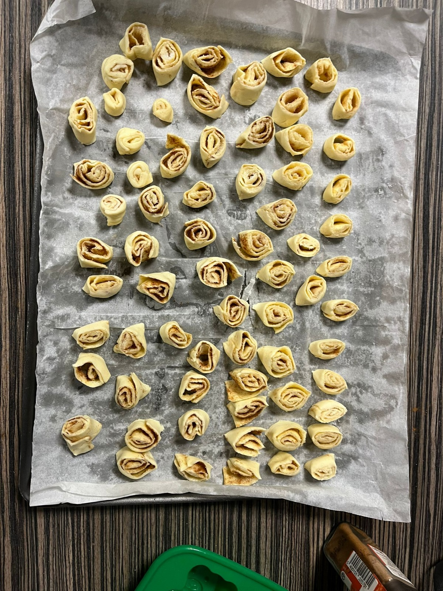

+++
date = '2024-12-10T11:02:40+01:00'
draft = false
title = 'Roulés Cannelle'
portions='+++'
categories = ['Desserts', 'Snacks']
+++

# Ustensiles

- Couteau
- Cuillère
- Papier cuisson

# Ingrédients

- Une pâte feuilletée
- Sucre
- Cannelle

# Préparation

1. Préchauffer le four à 200°C.
2. Étaler la pâte feuilletée.
3. Parsemer toute la pâte de sucre et de cannelle.
4. Couper la pâte en deux dans le sens de la longueur.
5. Enrouler chacune des deux demi-pâtes en veillant à bien serrer les rouleaux.
6. Couper des tranches de 1 cm d’épaisseur, les disposer en spirale sur la plaque.
7. Cuire à 200°C pendant 8 minutes, jusqu’à ce que les feuilletés soient dorés.

