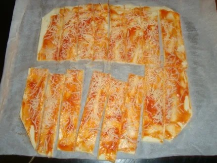

+++
date = '2025-02-02T00:02:40+01:00'
draft = false
title = 'Torsades Tomates Fromage'
portions='16'
categories = ['Plat']
+++

# Ustensiles

- Couteau
- Cuillère
- Papier cuisson

# Ingrédients

- Une pâte feuilletée
- Sauce tomate
- Fromage râpé

# Préparation

1. **Dérouler** la pâte feuilletée.
2. **Étaler** la sauce tomate dessus.
3. **Parsemer** de fromage râpé.
4. **Couper** la pâte en deux dans le sens de la largeur.
5. **Couper** de petites lamelles.
6. **Rouler** les lamelles sur elles-mêmes.
7. **Verser** un peu de fromage dessus pour gratiner.
8. **Enfourner** pendant 10-15 minutes à 180°C.

